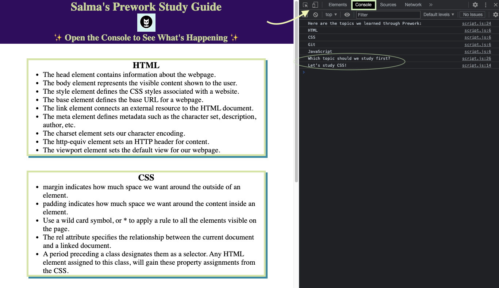

# Salma's bowl of code potpourri
> AKA Prework Study Guide Webpage

## Description

As this course starts, finding out what use for note taking purposes has been a dilemma. I searched high and low for a place to store code snippets, notes, hot keys, etc. but nothing showed promise.
Although, this is a required project, and my hands are tied here; this will serve as a place to hold the best and worst of my code collection, like a bowl of code potpourri. 
I was curious about the difficulty of this course and having a step by step guide helpped ease that anxiety. Doing the Prework helped set the tone for my expectations of learning pace, time management, and educational style.

*If anyone is reading this [Notion](https://www.notion.so/) and [Xmind](https://xmind.app/) are great for code note taking purposes.*

## Table of Contents

If your README is long, add a table of contents to make it easy for users to find what they need.

- [Installation](#installation)
- [Usage](#usage)
- [Credits](#credits)
- [License](#license)

## Installation

N/A

## Usage
For suggestions on what to study first from prework.
1. Open Chrome DevTools, by clicking `Command+Option+I` (MacOS) or `Control+Shift+I` (Windows.) 
You can also right click on your screen, and choose "inspect".
It should look like this:

2. Select " Console" on the top right bar to view a list of topics we learned from prework.

3. You can also get a topic of study suggestion from my list!

## Credits
- [Salma Loum](https://github.com/SalmaLoum/)
- [UCLA Extension Bootcamp](https://www.uclaextension.edu/?gclid=Cj0KCQiAgribBhDkARIsAASA5btdbwAz8x25r3b1deoRNIGxfkPFL11rAQMuCgQ7HYiqBH8CLr9CgLoaAktlEALw_wcB&gclsrc=aw.ds)

## License

Please refer to the LICENSE in the repo.